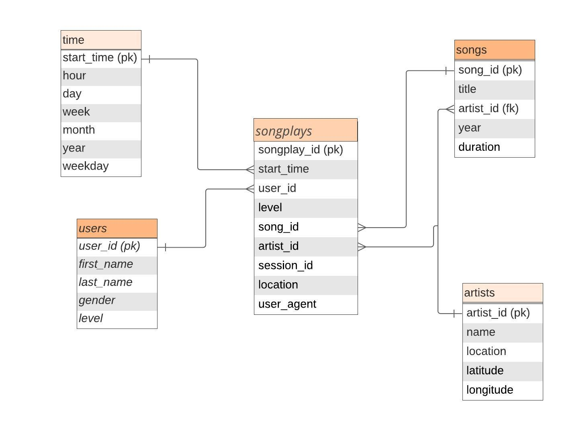

# The purpose of this database

This database has been created for a fictional startup called Sparkify. They want to analyze the data they've been collecting on songs and user activity on their new music streaming app. The analytics team is particularly interested in understanding what songs users are listening to. Currently, they don't have an easy way to query their data, which resides in a directory of JSON logs on user activity on the app, as well as a directory with JSON metadata on the songs in their app.

# Database Schema and ETL Pipeline


We decided to use a star schema, which enables simpler queries in comparison to the snowflake schema, but has some normalization at least in the fact table. 
As you can see in the `test.ipynb` or in the example queries, it is fairly easy to do complex queries to answer questions about songs played.

State and justify your database schema design and ETL pipeline.


# How to run the project

First run `python create_tables.py`. That will drop existing tables and start them anew. 

Then run `python etl.py`. That will run the simple ETL to put data into our Postgres. If you want to take a look into what happens at each step on the ETL, you can 

Finally, open the notebook `test.ipynb` and run all cells to get a grasp on the data inside each table. You can also create your own queries to run.

## Example queries

For example, to get the five most-heard artists we can run

```SQL
SELECT name as artist, time_played FROM (
    SELECT songs.artist_id, SUM(duration) as time_played FROM
    songplays JOIN songs ON songplays.song_id=songs.song_id
    GROUP BY songs.artist_id) as song_durations
JOIN artists ON song_durations.artist_id=artists.artist_id
ORDER BY time_played
LIMIT 5;
```